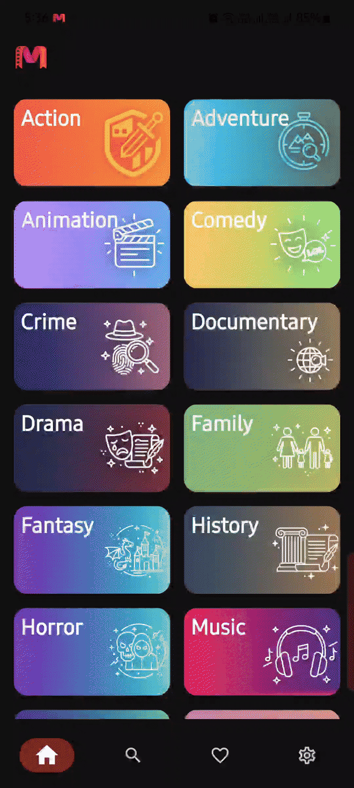
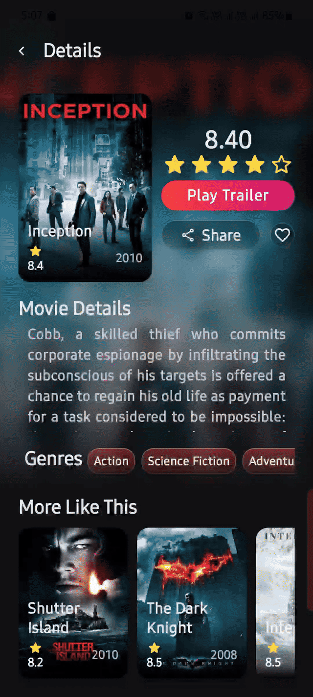
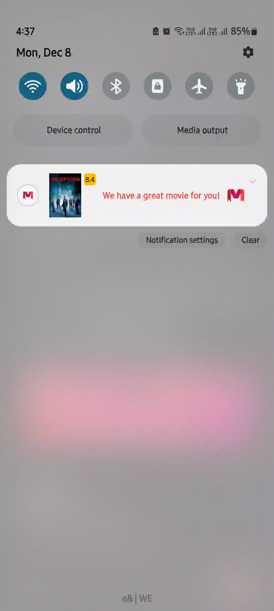
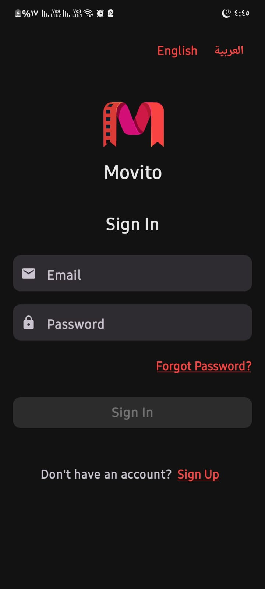
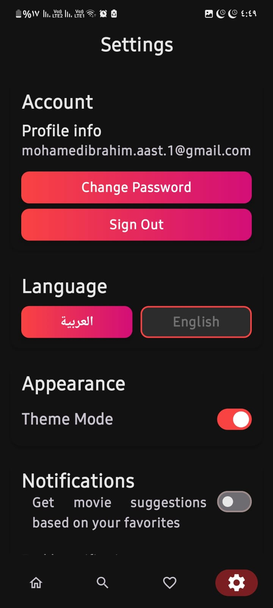
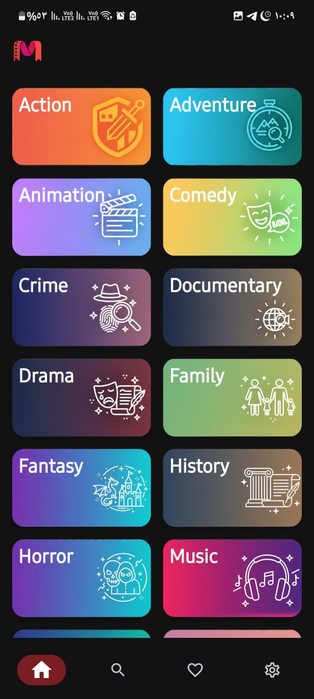
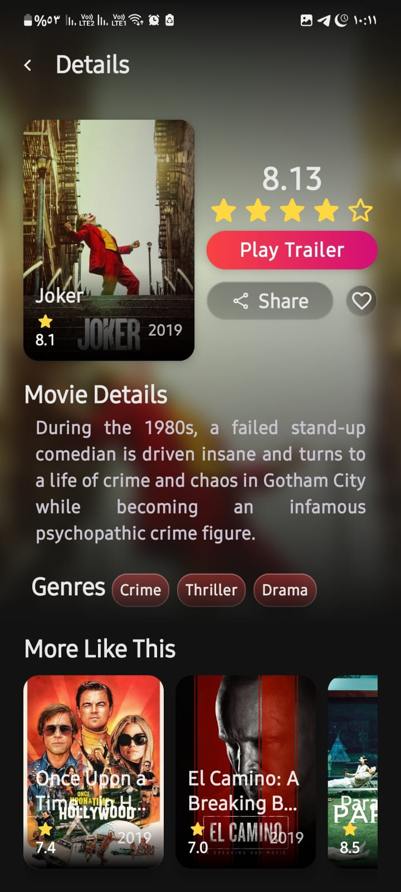
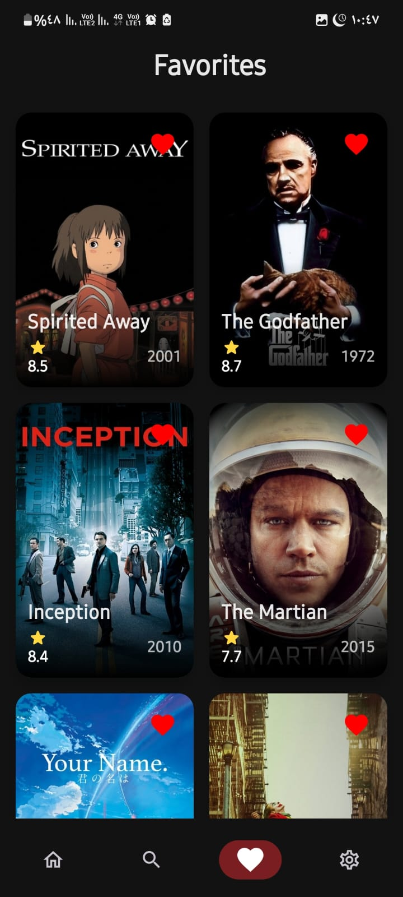

# 🎬 Movito  
*A modern movie discovery app built with Kotlin + Jetpack Compose*

<p align="center">
  
  
  
  
  
</p>

<p align="center">
  
</p>

The app fetches data from the TMDB API and stores user favorites in **Firebase Firestore**. It also provides scheduled recommendations notifications.

---

## 📱 Overview

Movito is a clean, fast, and modern Android movie-exploration app powered by:

- **Jetpack Compose**
- **TMDB API**
- **MVVM architecture**
- **Room Database**
- **WorkManager advanced notifications**
- **Firebase Authentication**

It allows users to browse trending movies, search titles, view deep movie details, save favorites, and receive smart scheduled movie recommendations.

---

## ✨ Features
<table>
<tr>
<td width="40%"></td>
<td>

### 🎞 Discover Movies
- Popular, trending, and top-rated lists  
- Genre-based browsing  

</td>
</tr>
</table>

<table>
<tr>
<td width="40%"></td>
<td>

### 📄 Movie Details
- HD posters, overview, release info  
- Watch/Sheare Trailer  
- Add to favorites  
- Similar movies 

</td>
</tr>
</table>

<table>
<tr>
<td width="40%"></td>
<td>

### ❤️ Favorites
- Save movies
- Persistent storage  
- Smooth animated UI  

</td>
</tr>
</table>


<table>
<tr>
<td width="40%"></td>
<td>

### 🔔 Smart Notifications
- Scheduled movie suggestions  
- Customizable frequency (every X hours)  
- Android 13+ permission support  
- Test notification buttons
- Arabic localization  

</td>
</tr>
</table>


### 🧑‍💻 Authentication
- Email & password login    
- Session persistence  

<p align="center">
  
  
  
</p>

### 🎨 Modern UI
- 100% Jetpack Compose  
- Material 3 
- Light / Dark / System themes  
- Custom splash screen  
- Arabic localization

<p align="center">
  
  
  
</p>

---

### 🏛 Architecture

Movito follows a clean MVVM architecture:

```
UI (Jetpack Compose)
  ↓
ViewModel (StateFlow)
  ↓
Repository
  ↓
Remote (TMDB API) + Remote DB (Firestore)
```

---

### Tech Stack
- Kotlin  
- Jetpack Compose (Material 3)  
- ViewModel + StateFlow  
- Coroutines  
- Retrofit
- Firebase Firestore (favorites + realtime listeners)
- WorkManager (notifications)
- Firebase Authentication  
- Coil (image loading)

---

## 📁 Project Structure

```
     
app/
 └── src/main/
     ├── java/com/movito/movito/
     │     ├── data/                 → Models + Retrofit API layer
     │     │     ├── model/          → Movie.kt and related data classes
     │     │     └── source/remote/  → RetrofitInstance, TmdbApi
     │     ├── favorites/            → Firestore favorites repository
     │     ├── notifications/        → All notification logic (Worker + helpers)
     │     ├── theme/                → Compose theme (colors, typography, shapes)
     │     ├── ui/                   → All screens (Activities + Compose screens)
     │     │     └── common/         → Shared composables (NavBar, dialogs, etc.)
     │     └── viewmodel/            → ViewModels for each feature
     ├── res/                        → Resources
     │     ├── anim/                 → Custom animations
     │     ├── drawable/             → Genre icons, UI icons, logos
     │     ├── layout/               → Notification layout XMLs
     │     ├── mipmap/               → Launcher icons
     │     └── values/               → strings.xml, themes.xml, colors.xml
     └── AndroidManifest.xml         → Activities, permissions, services (Worker)


```

---

## 🔧 Setup

### Requirements
- Android Studio Ladybug or newer  
- Minimum SDK: 29
- Target SDK: 36  
- TMDB API key  

### Add your TMDB API key  
Create or update:

`local.properties`
`tmdb_api_key=<your_api_key_here>`

### Run the App  
1. Open project in Android Studio
2. Sync Gradle
3. Run app on an emulator or device
    
---

## 🌍 Localization

Movito supports:

- 🇬🇧 English  
- 🇪🇬 Arabic (RTL + localized notifications)  

---

## 🤝 Contributors

|     Member<br>      | Role                                                                                                                                                                                        |
| :-----------------: | ------------------------------------------------------------------------------------------------------------------------------------------------------------------------------------------- |
| **Mohamed Ibrahim** | Team Lead · Home screen · Some Movie Details screen logic · <br>Navigation · Theme system · Core architecture · UI Test                                                                     |
|   **Ahmed Essam**   | Movie Details screen · Favorites integration · <br>Full Notification System · Notifications Settings · <br>Localization and bilingual support with Arabic/English switching · Documentation |
|  **Basmala Wahid**  | Favorites screen · Settings screen ·<br>Assist in theme system creation · Unit Test                                                                                                         |
|   **Alyaa Osama**   | Sign-Up screen · Welcome Notification                                                                                                                                                       |
|  **Youssef Sayed**  | Sign-In screen · Firebase Auth logic · Profile screen · Instrumented Test                                                                                                                   |
|  **Yehia Mohamed**  | Search screen · API integration                                                                                                                                                             |

---

## 🔬 Tests & QA

- RTL checks (Arabic)
- Notification scheduling & Firebase sync tests
- UI Test
- Instrumented Test
- Uint Test

---

## 📅 Roadmap & Future Vision

- Migrate from using intent to navigate to using compose navigation component
- Animations
- Actor details & filmography  
- Performance enhancement
- Search filters

---

## 🔐 License

This project is licensed under the **MIT License**.  
See the [LICENSE](./LICENSE) file for details.

---

## ⭐ Support

Star ⭐ the repo to support development!  
Feedback & PRs are welcome!

